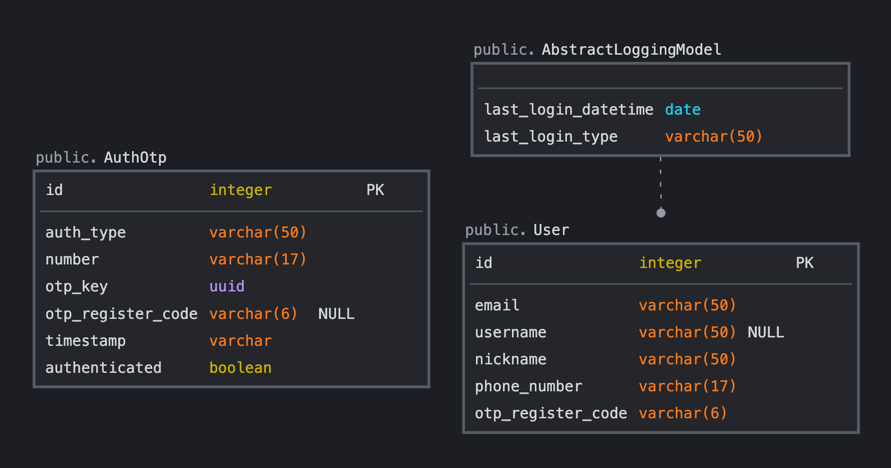

# 회원가입 및 비밀번호 재설정이 가능한 API 구현하기

## 기술스택
<table>
<tbody>
    <tr>
        <td>Python 3.9.13</td>
        <td>Django REST Framework 3.14.0</td>
        <td>PostgreSql 15.0</td>
    </tr>
</tbody>
</table>


## 구현기능 및 [API List](API_README.md)
- 회원가입 기능
- 로그인 기능 (이메일 / 사용자이름 / 닉네임 / 휴대폰 번호)
- 내 정보 보기 기능
- 비밀번호 찾기(재설정) 기능

## 유저 플로우
### 회원가입
- 전화번호 인증요청 및 인증수행
    - 하루에 최대 5번 인증요청을 보낼 수 있음 (기본 설정값)
    - 인증코드를 받은 후, 5분(300초) 이내로 인증을 완료해야 함
- 인증완료 정보(전화번호/인증번호)와 사용자 정보를 사용하여 회원가입 요청 수행
    - 인증이 완료되지 않은 전화번호를 사용하는 경우, 회원가입 제한

### 비밀번호 변경
- 비밀번호 재설정용 전화번호 인증요청 및 인증수행
- 인증완료 정보(전화번호/인증번호)와 새로운 비밀번호 문자열을 사용하여 비밀번호 재설정 요청
    - 이전에 사용한 비밀번호는 재사용할 수 없음
    - 회원가입되지 않은 전화번호에 대한 비밀번호 재설정 제한


## ER Diagram



## 설치
### 프로젝트 작동을 위해 정의된 기본변수
``` python
AUTH_USER_MODEL = 'users.User'          # Django User Model
OTP_TIME_INTERVAL = 300                 # 인증만료 시간(second)

REST_FRAMEWORK = {
    'DEFAULT_THROTTLE_RATES': {
        'default': None,
        'anon': '20/min',
        'user': '5000/day',
        'user.send_code': '5/day',      # 전화번호 인증요청 제한범위
        'user.verify_code': '50/day',   # 전화번호 인증 제한범위
    },
    'DEFAULT_RENDERER_CLASSES': [       # 사용자 설정 response renderer
        'utils.renderers.ResponseRenderer',
    ],
    'EXCEPTION_HANDLER': 'utils.exceptions.custom_exception_handler',   # 사용자 설정 exception handler
    'DEFAULT_AUTHENTICATION_CLASSES': [ # 사용자 지정 authentication class
        'rest_framework_simplejwt.authentication.JWTAuthentication',
    ]
}

SIMPLE_JWT = {
    "ACCESS_TOKEN_LIFETIME": datetime.timedelta(hours=1),   # access token 만료시간
    "REFRESH_TOKEN_LIFETIME": datetime.timedelta(days=1),   # refresh token 만료시간
    "BLACKLIST_AFTER_ROTATION": True,                       # 기존에 존재하던 refresh token blacklist 처리
    "UPDATE_LAST_LOGIN": True,
    "ALGORITHM": "HS256",
    "AUTH_HEADER_TYPES": ("Bearer",),
    "AUTH_HEADER_NAME": "HTTP_AUTHORIZATION",
    "TOKEN_OBTAIN_SERIALIZER": "users.serializers.LoginSerializer", # token 발급 serializer
}
```

### 실행 및 프로젝트 secret config 설정
``` shell
$ git clone https://github.com/soheeeeP/project.git

$ touch project/.env
$ echo POSTGRES_NAME='psqldb_name'
$ echo POSTGRES_USER='psqldb_user'
$ echo POSTGRES_PASSWORD='psqldb_password'
$ echo POSTGRES_PORT='psqldb_port'

$ docker-compose up -d --build      # 127.0.0.1:8000 접속
```
